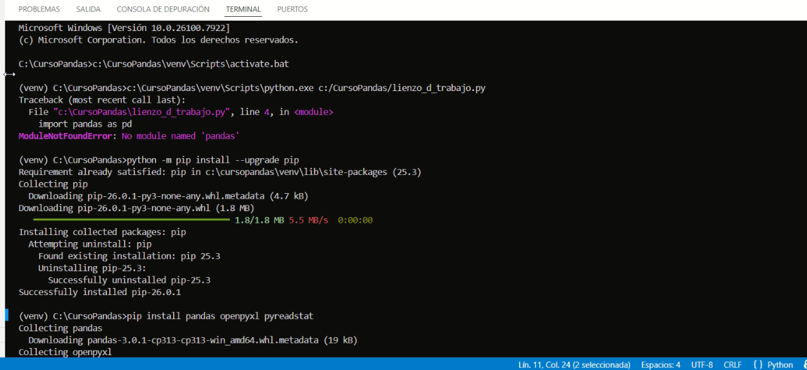
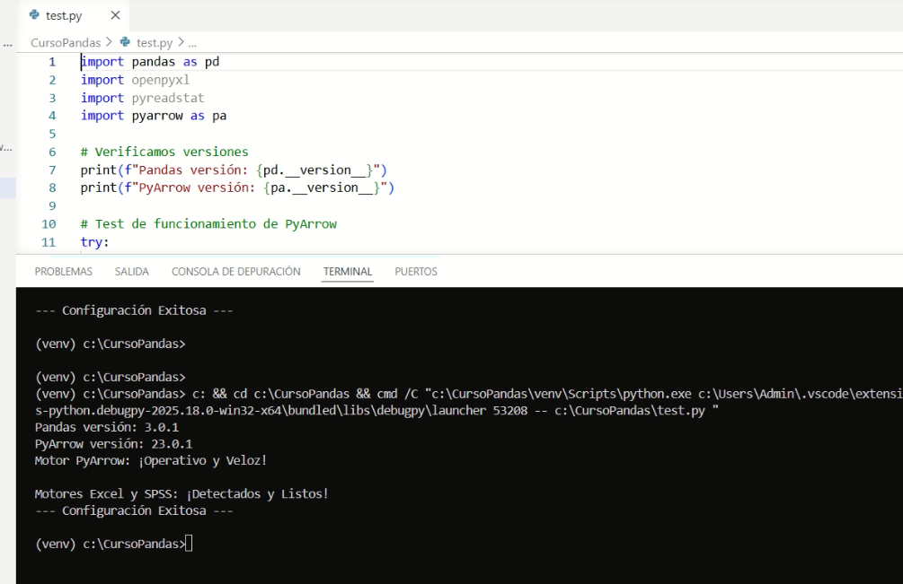

A continuación, presentamos una guía de instalación de las herramientas que nos acompañarán durante todo el curso. El objetivo es que los estudiantes logren autonomía técnica. La IA oficiará como asistente y como experto. 

Asumimos que somos usuarios de Windows 11 y que contamos con permisos de administrador en nuestros equipos; caso contrario, no podremos avanzar.

En la web y en la IA existen una enorme cantidad de formas de llegar más o menos al mismo resultado, dependiendo del estilo, necesidades y gusto de cada usuario. La que sigue es una guía "minimalista" que persigue el objetivo de contar con un entorno operativo que pueda ir creciendo a medida de nuestras necesidades, y no antes.

Este es un material "vivo" que se ajusta y modifica según las necesidades. La tecnología nos permite esta ventaja con poco esfuerzo: revisar, modificar y publicar en una misma acción. ¡Bienvenida/o a este sitio!

Todas las instrucciones y los links fueron probados. En caso de algún fallo, puede deberse a una errata y/o a un cambio posterior a la creación de este material; en ese caso, se agradecerá reportar el evento a `eduardo.lencina@gmail.com` para su evaluación y/o corrección. 

---

## 1. El Editor: Visual Studio Code (VSC)

El editor es nuestro lienzo de trabajo. Allí escribiremos código o copiaremos y pegaremos el código que le hayamos solicitado a la IA. Elegimos VSC porque es el estándar de la industria y el que se ajusta a los objetivos de establecer con solidez un pipeline de trabajo. Existen otras herramientas populares para aprender o enseñar, como `Jupyter Notebook` —YouTube está lleno de tutoriales donde los ejemplos se desarrollan allí— pero, a juicio de este curso, eso dificulta dar el salto a un *pipeline* profesional. 

VSC no es tan vistoso al principio ni es tan fácil para dar los primeros pasos, pero en cambio, cuando se dominan media docena de comandos de entorno y de conceptos, estamos listos para lo que viene en el mundo real del análisis y procesamiento de datos.

### 1.1 Instalación y Extensiones
1. Descargá el instalador para Windows en [code.visualstudio.com](https://code.visualstudio.com/download/).

2. Una vez instalado, ve al icono de cuadrados en la barra lateral izquierda (**Extensions**).
3. Busca e instala las siguientes extensiones:
   * **Python** (de Microsoft): Vital para que el editor entienda nuestro código.
   * **Spanish Language Pack**: Para tener la interfaz en castellano.
   * **GitHub Theme**: Permite configurar fondos y colores, similar a como se hace en el mundo Windows.

> **Nota sobre las extensiones:** Son paquetes que permiten dotar a VSC de nuevas capacidades. Normalmente, si queremos que VSC haga algo nuevo, necesitamos instalar la extensión correspondiente.

::: {.callout-important}
### Una buena idea es... 
Pedirle a la IA que nos explique más: "Respondeme como experto en Python, pandas y en Visual Studio Code. Estoy dando mis primeros pasos en el mundo Python+Pandas y quiero saber más sobre extensiones para VSC: ¿cómo se instalan?, ¿cómo sé si la tengo instalada?, ¿cómo se desinstalan?". Es una excelente forma de familiarizarse con el entorno y con el modo de interactuar con la IA.
:::

---

## 2. El Motor: Python 3.x

Python es el lenguaje, pero para que tu computadora lo "hable", necesitas instalar el **Intérprete** contenido en el instalador: `python-3.13.x-amd64.exe` (Windows installer 64-bit).

### 2.1 Pasos críticos para una instalación exitosa

1. **Descarga:** Ve a [python.org](https://www.python.org/downloads/windows/) y busca el link `Download Windows installer (64-bit)`. Este es el recomendado porque instala Python y el gestor de paquetes `pip`.
2. **La Pantalla de Configuración (Punto Crítico):** Ejecuta el archivo descargado. **¡ALTO! No hagas clic en "Install Now" todavía.** Debes marcar estas casillas en la parte inferior:
   * **Marcar "Add python.exe to PATH"**: Si no se marca, Windows no sabrá qué es "python" cuando lo escribas en la consola.
   * **Marcar "Use admin privileges when installing py.exe"**: Asegura los permisos necesarios en el sistema.
   * Haz clic en **"Customize installation"**.
3. **Características Opcionales (Optional Features):** Asegúrate de que todas estén marcadas, especialmente **pip** y **tcl/tk**. Haz clic en *Next*.
4. **Opciones Avanzadas (Advanced Options):** Aquí configuraremos una ruta limpia:
   * Marca **"Install Python 3.13 for all users"**.
   * **FUERTE RECOMENDACIÓN:** En "Customize install location", cambia la ruta a algo simple como `C:\Python313`. Anota esta ruta en un sitio que podamos consultar después.
   * Haz clic en **Install**.
5. **El paso final: "Disable path length limit":** Al terminar la barra de progreso, aparecerá una pantalla de éxito. Haz clic en el enlace que dice **"Disable path length limit"**. Esto elimina la restricción de 260 caracteres en Windows, evitando errores de rutas largas.

### 2.2 Verificando la instalación

Vamos a ir a la terminal `cmd`. Vamos a trabajar mucho con la terminal; para desplazarnos dentro de ella debemos aprender algunos comandos. Le podemos pedir a la IA una lista, es muy pequeña. 

::: {.monitor-box}
```python
# Abre la terminal (Windows + R, escribe 'cmd' y presiona Enter):

C:\Users\Admin>python --version
Python 3.13.x
```
:::

¿Qué significa todo esto? Que tenemos instalada la versión Python 3.13.x y que está activa; caso contrario, tenemos que comenzar de nuevo.

---

## 3. Preparando el laboratorio: Entorno Virtual

El siguiente paso es instalar el entorno virtual, que no es otra cosa que una modalidad utilizada para crear una "burbuja" de software para un objetivo específico. En nuestro caso, vamos a instalar un **Entorno Virtual** para análisis de datos.

El estilo que recomendamos es tener un solo **Entorno Virtual** centralizado en una carpeta de nuestra computadora. Cuidado aquí, porque la IA siempre nos lleva al concepto de "un proyecto, un entorno virtual", y es el punto donde tenemos que aclararle que nuestra preferencia es tener uno solo centralizado en la carpeta del curso. De esa forma, nosotros dirigimos lo que necesitamos a la IA y no al revés.

Es hora de crear nuestra carpeta en el sitio `C:\CursoPandas`. Es muy importante la ruta y el nombre, porque nuestra configuración recomendada se basa en que tengamos dicha carpeta. Más adelante podrán contar con otras carpetas y otros nombres de proyectos en paralelo.

### 3.1 Comandos para armar el laboratorio
Abrí la terminal en VS Code (`Terminal -> New Terminal`) y ejecutá estos comandos en orden:

::: {.monitor-box}
```python
# 1. Creamos la carpeta (si no la creaste antes manualmente)
mkdir C:\CursoPandas

# 2. Vamos a la carpeta:
cd C:\CursoPandas

# 3. Creamos el Entorno Virtual (la burbuja)
python -m venv venv

# 4. Activamos el entorno (encendemos la burbuja)
.\venv\Scripts\activate
```
:::


::: {.callout-note}
### Lo que estamos haciendo
* **`mkdir`**: Creamos el contenedor de nuestro proyecto.
* **`cd C:\CursoPandas`**: Nos movemos a la carpeta de trabajo.
* **`python -m venv venv`**: Crea una copia aislada de Python dentro de tu carpeta.
* **`activate`**: Notarás que aparece un **(venv)** al inicio de la línea de comandos. Indica que el laboratorio está activo.
* Podemos tener varios **Entorno Virtual (venv)**, pero en esta etapa de iniciación no lo recomendamos: preferimos tener uno instalado y que nuestros proyectos apunten siempre a la misma carpeta, en nuestro caso `C:\CursoPandas\venv`. 
:::

---

## 4. Instalando las herramientas de datos

Con el entorno activo `(venv) C:\CursoPandas>`, instalaremos Pandas y los motores necesarios.

::: {.monitor-box}
```python
# Actualizamos el instalador de paquetes
python -m pip install --upgrade pip

# Instalamos el cuarteto fundamental
pip install pandas openpyxl pyreadstat pyarrow
```
:::





::: {.callout-note}
### ¿Qué acabamos de hacer?
* **pip**: El instalador de paquetes oficial de Python. Es también un índice y es una buena práctica actualizarlo antes de cualquier instalación.
* **pandas**: Nuestra herramienta principal para análisis y procesamiento de datos.
* **openpyxl**: Permite leer y escribir archivos Excel (`.xlsx`).
* **pyreadstat**: Vital para leer bases de datos de SPSS (`.sav`).
* **pyarrow**: Necesario para bases Parquet
:::

---

## 5. El archivo code-workspace: `CursoPandas.code-workspace` 

Crea un archivo de texto en `C:\CursoPandas` llamado `CursoPandas.code-workspace` y pega este código exactamente así. 
¡Cuidado con la extensión! El nombre podrá ser cualquiera, pero la extensión `.code-workspace` es **MUY IMPORTANTE** para que VSC la reconozca como un archivo de configuración.

::: {.monitor-box}
```json
{
    "folders": [
        {
            "path": "."
        }
    ],
    "settings": {
        "terminal.integrated.allowChords": true,
        "terminal.integrated.enableMultiLinePasteWarning": false,
        "terminal.integrated.defaultProfile.windows": "Command Prompt",
        "terminal.integrated.profiles.windows": {
            "Command Prompt": {
                "path": [
                    "${env:windir}\\System32\\cmd.exe"
                ],
                "args": ["/k", "C:\\CursoPandas\\venv\\Scripts\\activate.bat"],
                "icon": "terminal-cmd"
            }
        },
        "python.defaultInterpreterPath": "C:\\CursoPandas\\venv\\Scripts\\python.exe",
        "python.terminal.activateEnvInCurrentTerminal": true,
        "debug.openDebug": "neverOpen",
        "terminal.integrated.fontFamily": "Consolas",
        "workbench.colorCustomizations": {
            "terminal.background": "#0c0c0c",
            "terminal.foreground": "#CCCCCC",
            "terminal.ansiGreen": "#A5D6A7",
            "terminal.ansiBlue": "#90CAF9"
        }
    }
}
```
:::

::: {.callout-note}
### ¿Qué acabamos de hacer?
`CursoPandas.code-workspace` es un archivo de configuración que nos acompañará adonde vayamos: guarda nuestras preferencias, sabe dónde está el "venv" y, lo más importante, lo **ACTIVA** automáticamente. 
:::

---

::: {.callout-tip}
## 🆘 Mesa de Ayuda: 
El archivo `.code-workspace` es un archivo de extensión JSON de configuración y es un poco "tiquismiquis" con las sangrias y los espacios. Una buena practica es pedirl a la IA que ajuste el archivo `.code-workspace` por nosotros. 
:::
---

::: {.gray-italic-box}
**Zona de Prompting:** "Actúa como experto en Windows y Visual Studio Code. Genera el contenido para un archivo `ProyectoPandas.code-workspace`. Mi carpeta de proyecto es `C:\CursoPandas` y mi entorno virtual está en `C:\CursoPandas\venv\`. Asegúrate de que el `python.defaultInterpreterPath` apunte correctamente a `Scripts/python.exe` y que el terminal reconozca el venv automáticamente al abrir el espacio de trabajo. Devuélveme el código en formato JSON."
:::

::: {.callout-tip}
## 🆘 Mesa de Ayuda: El Workspace no reconoce mi venv
Si después de usar el prompt y crear el archivo, VS Code no activa el entorno automáticamente:

1. **Cierra y abre:** VS Code a veces necesita un "reinicio" para leer los cambios del workspace.
2. **Selección Manual:** Presiona `Ctrl + Shift + P`, busca "Python: Select Interpreter" y elige el que está dentro de la carpeta `venv`.
3. **Rutas:** Verifica que en el archivo no haya quedado ninguna barra invertida simple (`\`). En los archivos de configuración de VS Code, se deben usar barras inclinadas (`/`) o doble barra (`\\`).
:::

### 5.1 Apertura desde la Terminal (CMD)
Lanzar el archivo 'ProyectoPandas.code-workspace' desde la terminal es el método más avanzado: carga configuraciones específicas y rutas predefinidas de un solo golpe.

**Instrucciones:** Abrir la terminal (**Tecla Win + R**, escribir 'cmd' y **Enter**).

::: {.monitor-box}
```python
# --- TERMINAL DE WINDOWS (CMD) ---

# 1. Navegar a la raíz del disco C:
cd \

# 2. Entrar a la carpeta del proyecto
cd C:\CursoPandas

# 3. Lanzar el Workspace de Visual Studio Code
code CursoPandas.code-workspace
```
:::

::: {.callout-note}
## Lo que estamos haciendo
1. **Navegación:** Usamos 'cd \' para ir a la base del disco y luego 'cd C:\CursoPandas' para entrar en nuestra carpeta de trabajo.
2. **Lanzamiento:** El comando 'code' abre VS Code, y al pasarle el nombre del archivo '.code-workspace', el editor se abre con todas nuestras preferencias ya cargadas.
:::

::: {.gray-italic-box}
**Zona de Prompting:** "Actúa como experto en Windows y Ciencia de Datos. Explícame el paso a paso para ingresar a mi proyecto en Visual Studio Code desde la terminal de Windows (CMD), considerando que mi carpeta de trabajo es C:\CursoPandas y utilizo un archivo .code-workspace."
:::

---


### 5.2 El `(venv)` Rebelde

En la instalación, el `(venv)` puede negarse a estar activo desde la primera vez. Es algo con lo que debemos convivir.

**El paso manual:**
1. Presiona **Ctrl + Shift + P**.
2. Escribe: **Python: Select Interpreter**.
3. Selecciona la opción. Verás una lista de los Python encontrados.
4. Si no ves el de `C:\CursoPandas\venv`, haz clic en **+ Enter interpreter path...**.
5. Haz clic en **Find...** y selecciona el ejecutable en: `C:\CursoPandas\venv\Scripts\python.exe`.

**Otra buena práctica:** & 1. Presiona **Ctrl + Shift + P**.
2. Escribe: **Recargar ventana**. 
Esto fuerza a VSC a leer nuevamente el workspace.

### 5.3 La burbuja MUY rebelde 

Si sigue sin activarse, siempre podemos hacerlo manualmente en la terminal: 

::: {.monitor-box}
```python
# 1. Presiona Ctrl + ñ. 
# 2. Asegúrate de estar en la ruta (si no, usa cd):
cd C:\CursoPandas

# 3. Activamos manualmente:
.\venv\Scripts\activate
```
:::

---

::: {.gray-italic-box}
**Zona de Prompting:** "Actúa como experto en Windows, Python y Visual Studio Code. Este es mi 'workspace' (subir archivo). Ayúdame a verificar la configuración para asegurar que el entorno virtual se active automáticamente al abrir la carpeta."
:::


## 6. Verificación Final de Librerías

Antes de dar por terminada la instalación, vamos a ejecutar un pequeño archivo `test.py`. Si este código corre sin darnos errores (letras rojas), significa que tu laboratorio está 100% operativo.

::: {.monitor-box}
```python
# --- TEST DE SALUD DEL ENTORNO test.py---

import pandas as pd
import openpyxl
import pyreadstat
import pyarrow as pa

# Verificamos versiones
print(f"Pandas versión: {pd.__version__}")
print(f"PyArrow versión: {pa.__version__}")

# Test de funcionamiento de PyArrow
try:
    tabla_test = pa.Table.from_pandas(pd.DataFrame({'test': [1, 2, 3]}))
    print("Motor PyArrow: ¡Operativo y Veloz!")
except Exception as e:
    print(f"Error en PyArrow: {e}")

print("\nMotores Excel y SPSS: ¡Detectados y Listos!")
print("--- Configuración Exitosa ---")


```
:::

::: {.callout-note}
### Lo que estamos haciendo
* **`import pyarrow as pa`**: Importamos la librería con el alias `pa`. Es el estándar en la industria.
* **`pa.Table.from_pandas`**: Es una prueba de fuego. Le pedimos a PyArrow que convierta una tabla de Pandas a su formato nativo. Si esto funciona, la librería está perfectamente vinculada.
* **`try / except`**: Es una estructura de seguridad. Si algo falla, en lugar de cerrarse bruscamente, el programa nos explicará qué pasó.

:::


## 7. Formas de ejecutar nuestro script "test.py"

En VS Code existen tres caminos para "darle Play" a nuestro código. Aprenderlos te dará la velocidad necesaria para trabajar como un profesional.

---

### 7.1 Opción A: El camino del Mouse (Visual)
Es la forma más intuitiva al empezar. 

* **1.** Abre tu archivo `test.py` en el editor.
* **2.** Busca en la esquina superior derecha un pequeño icono de **"Play"** (un triángulo hacia la derecha).
* **3.** Haz clic allí. VSC abrirá la terminal automáticamente y ejecutará el código.

---

### 7.2 Opción B: El Atajo de Teclado (Velocidad)
Cuando estés procesando datos, no querrás soltar el teclado. Este es el método que usan los expertos:

* **Atajo:** Presiona la tecla `Ctrl + F5` .
* **Resultado:** El código se dispara instantáneamente. El favorito.

---

### 7.3 Opción C: Directo desde la Terminal (Control Total)
Esta es la forma más "pura" y la que mejor te permite entender qué está pasando. Aquí tú tienes el mando.

::: {.monitor-box}
```python
# 1. Asegúrate de estar en la carpeta correcta:
(venv) C:\CursoPandas>

# 2. Escribe el nombre del intérprete seguido del nombre del archivo:
(venv) C:\CursoPandas>python test.py
```
:::

::: {.callout-note}
## Lo que estamos haciendo
* **`python`**: Es el comando que llama al motor que instalamos en la Clase 01.
* **`test.py`**: Es el "papel" con las instrucciones que el motor debe leer, el archivo que acabamos de escribir.
* Si el archivo estuviera en otra carpeta, tendrías que navegar con `cd` antes de lanzarlo.
:::

---

## 7.4 Mesa de Ayuda: "No pasa nada al ejecutar"

::: {.callout-tip}
## 🆘 S.O.S. Mi código no arranca
1. **¿Guardaste el archivo?** Si ves un círculo blanco en la pestaña del nombre del archivo en VSC, significa que hay cambios sin guardar. Presiona `Ctrl + S`.
2. **¿El venv está activo?** Si en la terminal no ves el prefijo `(venv)`, el comando `python` podría fallar o no encontrar las librerías.
3. **Error de nombre:** Si tu archivo se llama `Prueba.py` y escribes `python prueba.py` (en minúsculas), a veces Windows lo perdona, pero es una mala práctica. Acostúmbrate a respetar las mayúsculas.
:::

---

::: {.gray-italic-box}
**Zona de Prompting:** "Actúa como experto en productividad en Visual Studio Code. Enséñame otros atajos de teclado útiles para manejar la terminal integrada (abrir, cerrar, limpiar) que me ayuden a trabajar más rápido con mis scripts de Python."
:::

### 7.5 Como debería verse una vez ejecutado  `test.py` :




