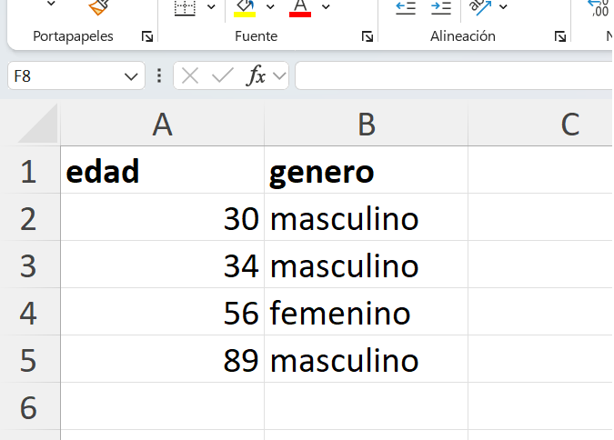
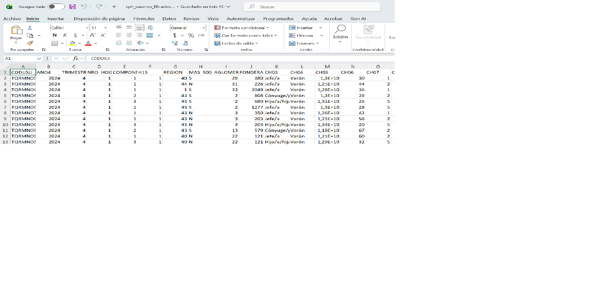
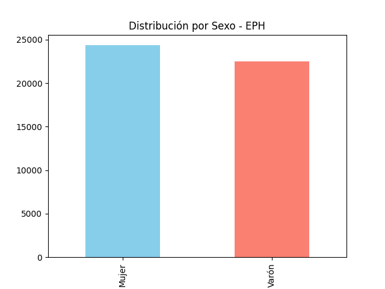

## 1. Manos a la obra

El enfoque de este capítulo es familiarizarse con algunos comandos y acciones comunes al procesamiento y analisis de datos, ganar confianze e introducirse en los temas.

### 1.1  Cargamos la base SAV

Iniciamos nuestro script asegurando la carga de la librería y el acceso a los datos de la EPH.

::: {.monitor-box}
```python
# --- CARGA DE BASE EPH ---

import pandas as pd

# Definición de ruta con Raw String (r)
ruta = r'c:\CursoPandas\data\input\24Q4_INDIVIDUOS.sav'

# Carga de datos utilizando el motor instalado
df = pd.read_spss(ruta)

# Inspección inicial
print(df.head())
```
:::

::: {.callout-note}
## Lo que estamos haciendo
1. **Importamos la herramienta:** Traemos 'pandas' con el alias 'pd'.
2. **Especificamos el camino:** Usamos una variable 'ruta' con el prefijo 'r' (raw string) para que Windows no confunda las barras invertidas de la dirección del archivo.
3. **Leemos el archivo:** El comando `read_spss` traduce el formato de SPSS a una tabla de Python (DataFrame).
4. **Primer vistazo:** `print(df.head())` nos muestra las primeras 5 filas para verificar que la carga fue exitosa.
:::

---

::: {.callout-tip}
## 🆘 Mesa de Ayuda: ¿No sale el resultado?

Si al ejecutar el código la terminal se queda en blanco o te da un error, revisa estos tres puntos clave:

1. **El nombre de la base:** Asegúrate de que el archivo `.sav` o `.xlsx` esté realmente en la carpeta `data/input/`. Si el nombre tiene un error de ortografía, Python no lo encontrará.
2. **El entorno activo:** Verifica que en la terminal de VS Code veas el prefijo **(venv)**. Si no está, las librerías como Pandas no funcionarán.
3. **Las comillas y paréntesis:** Recuerda que los textos siempre van entre comillas `' '` y las acciones (métodos) siempre terminan en `()`.
:::

---

### 1.1 Cargamos una base de ejemplo Excel

Es una digresión, solo para ver las similitudes:



::: {.monitor-box}
```python
# --- INSTALACIÓN DEL MOTOR PARA EXCEL ---
# Desde la terminal (con el venv activo):
# pip install openpyxl

# --- CARGA DE BASE DESDE EXCEL ---
import pandas as pd

# Definición de ruta
ruta_excel = r'c:\CursoPandas\data\input\base_excel_ejemplo1.xlsx'

# Carga de datos especificando el motor (engine)
df_excel = pd.read_excel(ruta_excel, engine='openpyxl')

# Inspección inicial
print("Comando: df_excel.head()")
print(df_excel.head())
```
:::

---

::: {.callout-important}
## Librerías invisibles: Los "Motores" de Pandas
Es fundamental entender que `import pandas` nos da las funciones de análisis, pero Pandas delega la lectura de archivos específicos a otros "especialistas" o motores que debemos instalar en nuestro `venv`:

1. **Para archivos .sav (SPSS):** El especialista es **pyreadstat**.
2. **Para archivos .xlsx (Excel):** El especialista es **openpyxl**.
3. **Para archivos .csv:** No requiere motor externo, Pandas lo lee de forma nativa.

Sin estos motores instalados, los comandos `read_spss` o `read_excel` devolverán un error de sistema.
:::

---

## 2. Comandos de Inspección: ¿Qué tenemos en la base?

Antes de operar, debemos "mirar" la base para conocer la naturaleza de nuestras columnas y el tipo de dato que almacenan.

::: {.monitor-box}
```python
import pandas as pd

# Definición de ruta con Raw String (r)
ruta = r'c:\CursoPandas\data\input\24Q4_INDIVIDUOS.sav'

# Carga de datos utilizando el motor instalado
df = pd.read_spss(ruta)


# --- INSPECCIÓN INICIAL ---

# 1. Diagnóstico de columnas y tipos de datos
print("Comando: df.info()")
print(df.info()) 

# 2. Dimensiones de la tabla (Filas, Columnas)
print("Comando: df.shape")
print(df.shape)
```
:::

::: {.callout-note}
## Lo que estamos haciendo
1. **Diagnóstico Estructural:** `df.info()` nos dice cuántos datos no nulos tenemos y el tipo técnico (Dtype). Es vital para saber si la "Edad" es un número o un texto.
2. **Tamaño del objeto:** `df.shape` nos devuelve dos números. El primero es la cantidad de registros y el segundo la cantidad de variables.
:::

---

## 3. Análisis de Variables Específicas

Nos enfocaremos en dos variables clave de la EPH: **'CH06'** (Edad) y **'CH04'** (Sexo).

::: {.monitor-box}
```python
# --- EXPLORANDO VARIABLES ---
import pandas as pd

# Definición de ruta con Raw String (r)
ruta = r'c:\CursoPandas\data\input\24Q4_INDIVIDUOS.sav'

# Carga de datos utilizando el motor instalado
df = pd.read_spss(ruta)

# 1. Valores únicos en edad
print("Comando: df['CH06'].unique()")
print(df['CH06'].unique())

# 2. Conteo de frecuencias en sexo
print("\nComando: df['CH04'].value_counts()")
print(df['CH04'].value_counts())
```
:::

---

## 4. Ejemplo de selección y filtrado

En muchos sentidos procesar y analizar datos consiste en obtner métricas de un subconjunto de datos.
Aqui nuestro 'query' de ejemplo.

### 4.1 Filtrar por Varones
Queremos ver la edad solo de los varones ('CH04 == "Varón"').

::: {.monitor-box}
```python
# --- FILTRO SIMPLE ---

import pandas as pd

# Definición de ruta con Raw String (r)
ruta = r'c:\CursoPandas\data\input\24Q4_INDIVIDUOS.sav'

# Carga de datos utilizando el motor instalado
df = pd.read_spss(ruta)


# Seleccionamos filas donde sexo es varón
varones = df.query('CH04 == "Varón"')

# ¿Cuántos varones hay y cuál es su edad promedio?
print(f'Total varones: {len(varones)}')
print(f'Edad promedio varones: {varones["CH06"].mean():.2f}')


# Metodo .mean()

#La estructura es: {valor : formato} ver el rol de los ":"

#Desglose de la instrucción
# [varones["CH06"].mean()] : Es la parte del "valor".

# [.2f] : Es la instrucción de formato:
# .2: Indica que quieres 2 decimales.


```
:::

---

### 4.2 Anatomía de una f-string: {len(varones)}

Esta línea de código es un ejemplo fundamental de cómo Python comunica resultados numéricos mediante texto legible. En programación, esto se denomina **f-string** (Formatted String Literal).

::: {.monitor-box}
```python

# La 'f' antes de las comillas activa el modo interactivo
print(f'Total varones: {len(varones)}')

```
:::


## Desglose del comando:

1. **La letra `f`**: Al anteponer una `f` a las comillas, le indicamos a Python que el texto contendrá "agujeros" (llaves `{}`) que deben ser rellenados con valores calculados en tiempo real.
2. **Las llaves `{ }`**: Todo lo que escribamos dentro de las llaves será ejecutado como código vivo antes de mostrarse en pantalla.
3. **La función `len()`**: Es la abreviatura de *length* (longitud). Cuando se aplica a un DataFrame de Pandas (como nuestro objeto `varones`), su función es **contar la cantidad total de filas** que sobrevivieron al filtro.

---

::: {.callout-note}
## De dato a información
Si ejecutáramos simplemente `print(len(varones))`, la terminal nos devolvería un número suelto (ej: `8420`). Para un analista, ese dato carece de contexto. Al usar la f-string, transformamos un valor crudo en **información interpretable**: "Total varones: 8420".
:::

---

::: {.gray-italic-box}
**Zona de Prompting:** "Actúa como experto en Python. Explícame la diferencia técnica entre usar **len(df)** y **df.shape[0]** para contar registros en un DataFrame de Pandas. ¿Cuál es más eficiente cuando trabajamos con bases de datos de gran volumen como la EPH?"
:::


## 5. Estructura de Datos: dtypes y Niveles de Medición

En el análisis con Pandas, la naturaleza técnica del dato determina las operaciones permitidas. No basta con "ver" un número; es necesario que el intérprete lo reconozca bajo un tipo de dato (Dtype) específico para evitar errores de tipo (TypeError).

| Concepto Estadístico | Tipo en Pandas (Dtype) | Descripción |
| :--- | :--- | :--- |
| **Numérica** | `int64` o `float64` | Variables para cálculo matemático (Edad, Ingresos). |
| **Nominal (Texto)** | `object` o `string` | Etiquetas alfanuméricas sin orden intrínseco. |
| **Categorizada** | `category` | Variables con valores fijos (Nivel Educativo, Sexo). |

::: {.callout-note}
## El tipo 'category': Eficiencia y Orden
El tipo de dato `category` es una de las funciones potentes de Pandas. A diferencia del tipo `object`, permite definir un **orden lógico** (por ejemplo: Primario < Secundario < Universitario), vital para el análisis de variables ordinales.
:::

::: {.monitor-box}
```python
# --- DIAGNÓSTICO DE TIPOS ---

import pandas as pd

# Definición de ruta con Raw String (r)
ruta = r'c:\CursoPandas\data\input\24Q4_INDIVIDUOS.sav'

# Carga de datos utilizando el motor instalado
df = pd.read_spss(ruta)

# Verificamos la estructura técnica de las primeras 15 columnas
print("Resumen de Tipos de Datos (Dtypes):")
print(df.dtypes.head(15))
```
:::

---

::: {.monitor-box}
```python

# --- DIAGNÓSTICO DE TIPOS II ---


import pandas as pd

# Definición de ruta con Raw String (r)
ruta = r'c:\CursoPandas\data\input\24Q4_INDIVIDUOS.sav'

# Carga de datos utilizando el motor instalado
df = pd.read_spss(ruta)


# Definimos la lista de variables que nos interesan
variables_interes = ['CH04', 'CH06', 'NIVEL_ED', 'P21', 'P47T']

print("Diagnóstico de variables seleccionadas:")
print(df[variables_interes].dtypes)

```
:::

---

## 6. El Ciclo de Datos Completo: Carga, Filtro y Exportación

Es habitual usar Excel como un "visualizador de resultados". Permite "ver" y compartir de forma sencilla. En este ejemplo realizamos el proceso completo: extraemos de SPSS, aislamos una subpoblación y generamos un reporte.

::: {.monitor-box}
```python
# --- PROCESO AUTÓNOMO DE EXPORTACIÓN ---
import pandas as pd
import os

# 1. DEFINICIÓN DE RUTAS
ruta_entrada = r'c:\CursoPandas\data\input\24Q4_INDIVIDUOS.sav'
ruta_salida = r'c:\CursoPandas\data\output\eph_varones_filtrados.xlsx'

# 2. CARGA DE DATOS
print("Leyendo base original...")
df = pd.read_spss(ruta_entrada)

# 3. PROCESAMIENTO (Consulta)
# Filtramos varones (CH04) con ingresos positivos (P21 > 0)
consulta_ejemplo = 'CH04 == "Varón" and P21 > 0'
df_resultado = df.query(consulta_ejemplo)

# 4. EXPORTACIÓN
df_resultado.to_excel(ruta_salida, index=False)

print("-" * 30)
print(f"Proceso finalizado con éxito.")
print(f"Registros procesados: {len(df_resultado)}")
print(f"Archivo disponible en: {ruta_salida}")
```
:::




::: {.callout-important}
## El parámetro index=False
Por defecto, Pandas intenta guardar una columna extra con los números de fila. Al usar `index=False`, nos aseguramos de que el Excel sea una réplica exacta de nuestras variables.
:::

---

## 7. Representación Gráfica: De la Frecuencia al Histograma

La visualización es una herramienta de diagnóstico. Pandas utiliza internamente la librería **Matplotlib** para generar gráficos directamente desde los objetos.

### 7.1 Preparación del Entorno
Instalamos la librería (solo la primera vez) desde la terminal de VS Code:

::: {.monitor-box}
```bash
# Con el (venv) activo:
pip install matplotlib
```
:::

### 7.2 Ejecución del Gráfico de Frecuencias
Transformaremos el conteo de la variable `CH04` (Sexo) en un gráfico de barras.

::: {.monitor-box}
```python
# --- VISUALIZACIÓN EXPLORATORIA ---
import pandas as pd
import matplotlib.pyplot as plt
import os

# DEFINICIÓN DE RUTAS
ruta_entrada = r'c:\CursoPandas\data\input\24Q4_INDIVIDUOS.sav'
carpeta_output = r'c:\CursoPandas\data\output'
os.makedirs(carpeta_output, exist_ok=True)

# CARGA Y PROCESO
df = pd.read_spss(ruta_entrada)
conteo_sexo = df['CH04'].value_counts()

# GENERACIÓN Y GUARDADO DEL GRÁFICO
conteo_sexo.plot(kind='bar', 
                 title='Distribución por Sexo - EPH', 
                 color=['skyblue', 'salmon'])

ruta_grafico = os.path.join(carpeta_output, 'grafico_sexo.png')
plt.savefig(ruta_grafico)
print(f"\nGráfico exportado con éxito en: {ruta_grafico}")
```
:::

---




::: {.gray-italic-box}
**Zona de Prompting:** "Actúa como experto en arquitectura de datos. Explícame la relación técnica entre Pandas y Matplotlib. ¿Por qué es necesario instalar Matplotlib por separado si el comando .plot() pertenece a Pandas?"
:::


---

# 8. Resumen de Herramientas Utilizadas

En esta sesión hemos integrado funciones de lectura, inspección, filtrado y salida. Este es el "kit de supervivencia" básico para cualquier analista de datos sociales:

| Comando / Librería | Función Principal |
| :--- | :--- |
| **pd.read_spss()** | Traduce el formato cerrado de SPSS a un DataFrame de Python. |
| **pd.read_excel()** | Carga planillas de cálculo tradicionales vinculando el motor `openpyxl`. |
| **df.info()** | Provee un diagnóstico de integridad (datos no nulos) y memoria. |
| **df.dtypes** | Revela la naturaleza técnica (Dtype) de cada columna de la base. |
| **df.shape** | Devuelve las dimensiones de la tabla (cantidad de casos y variables). |
| **df.unique()** | Lista los valores sin repetir de una columna (ideal para ver categorías). |
| **df.value_counts()** | Genera una tabla de frecuencias de una variable nominal u ordinal. |
| **df.query()** | Ejecuta segmentaciones de la base mediante condiciones lógicas. |
| **df.to_excel()** | Exporta los resultados procesados a un archivo externo compatible. |
| **plt.savefig()** | Captura la visualización activa y la persiste como un archivo de imagen. |


---
