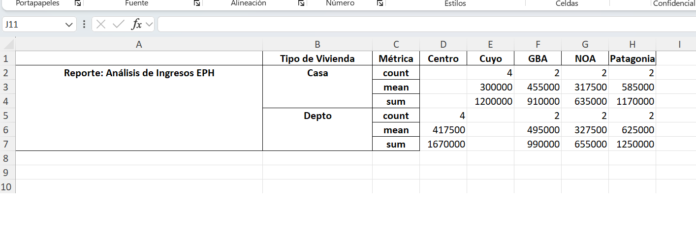
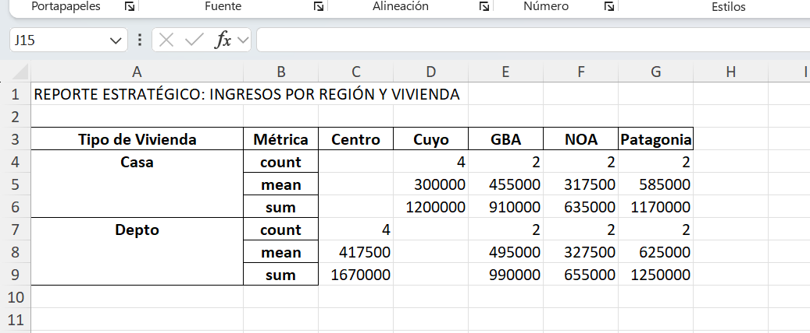

## 1. El DataFrame como Unidad de Sentido

Técnicamente un **DataFrame** es una **colección de Series (columnas) vinculadas por un Índice común**. El indice **no es parte** de los datos de nuestro dataframe, en la imagen podemos observarlo con claridad.


### 1.1 El DataFrame frente a la Hoja de Cálculo

Si el Excel es un lienzo de acceso libre donde cada celda puede funcionar como una unidad independiente (una "isla" de datos con su propia lógica o formato), el DataFrame de Pandas es una entidad de datos estructurada y programática. Esta diferencia de arquitectura es fundamental para la integridad de los procesos de analisis:

* **Cohesión de Fila:** En una matriz de datos (DataFrame), la fila es la unidad mínima de información. Si aplicamos una operación de reordenamiento (sorting) o un filtrado, el registro se desplaza como un bloque compacto. Esto garantiza que los atributos de una observación —por ejemplo, un `ID`, un `Ingreso` y una `Categoría`— permanezcan vinculados de forma indisoluble.

* **Tipificación de Columna:** A diferencia de las celdas de una hoja de cálculo, que pueden contener tipos de datos mixtos en una misma columna, las Series de un DataFrame imponen una **consistencia de tipo** (`dtype`). Esta restricción es la que permite realizar cálculos vectorizados de alta performance.

Nuestro enfoque es **Dataframe Céntrico** vamos a tratar de no irnos por las ramas de los conceptos de programación para reconocernos como **usuarios de programación** analistas que escribimos código funcional y ahora también asistidos por IA .
Si el DataFrame está bien construido y su índice es sólido, los cálculos de agregación podremos construirlos de manera **natural**. El DataFrame es el mapa; los métodos de agrupación son nuestra brújula.

---


::: {.monitor-box}
```python

# ESTRUCTURA DE LA MATRIZ Y TABLAS DE DOBLE ENTRADA ---
import pandas as pd
import numpy as np

# 0. Preparación del DataFrame (Simulacro EPH Ampliado)
# Generamos una base con 20 casos para permitir agrupamientos significativos

data = {
    'cod_hogar': [
      'H_001', 'H_002', 'H_003', 'H_004', 'H_005', 
      'H_006', 'H_007', 'H_008', 'H_009', 'H_010', 
      'H_011', 'H_012', 'H_013', 'H_014', 'H_015', 
      'H_016', 'H_017', 'H_018', 'H_019', 'H_020'
    ],
  'region': [
      'GBA', 'NOA', 'Patagonia', 'Cuyo', 'Centro',
      'GBA', 'NOA', 'Patagonia', 'Cuyo', 'Centro',
      'GBA', 'NOA', 'Patagonia', 'Cuyo', 'Centro',
      'GBA', 'NOA', 'Patagonia', 'Cuyo', 'Centro'
    ],
    'tipo_vivienda': ['Casa',  'Depto', 'Casa',  'Casa', 'Depto', 
                      'Depto', 'Casa',  'Depto', 'Casa', 'Depto',
                      'Casa',  'Depto', 'Casa',  'Casa', 'Depto', 
                      'Depto', 'Casa',  'Depto', 'Casa', 'Depto'],

    'ingreso': [450000, 320000, 580000, 310000, 420000, 490000, 310000, 620000, 280000, 410000,
                460000, 335000, 590000, 315000, 425000, 500000, 325000, 630000, 295000, 415000],

    'edad_jefe': [45, 32, 58, 29, 41, 36, 52, 47, 33, 40, 44, 31, 57, 30, 42, 35, 51, 46, 34, 39]
}


df = pd.DataFrame(data).set_index('cod_hogar')

# Creamos la ruta de guardado de base 
ruta_entrada = r"data\input\\"

# Guardado de base 
df.to_excel(ruta_entrada+"base_inicial.xlsx")

# 1. Ejecución del Pipeline: Tabla de Doble Entrada
# El objetivo es cruzar 'tipo_vivienda' (Filas) y 'region' (Columnas) 
# para observar la media de 'ingreso'.

# Etapa 1: Creación de la pivot table
# Usamos una sintaxis transparente donde cada parámetro define un eje.
df_resumen = df.pivot_table(
    index='tipo_vivienda', 
    columns='region', 
    values='ingreso', 
    aggfunc='mean'
)

# Etapa 2: Formateo de salida (Redondeo)
# Aplicamos el método sobre el resultado anterior para limpiar la visualización.
df_resumen = df_resumen.round(2)

print("Paso 1: Tabla de doble entrada (Ingreso promedio por Región y Vivienda):")
print(df_resumen)
print("-" * 30)

# 2. Salida a formato externo
# El dataframe resumen es una nueva unidad de sentido lista para ser compartida.
ruta_salida = r"data\output\\"

# Resultado
df_resumen.to_excel(ruta_salida+"resumen_ingresos.xlsx")


```
:::

---

## 2 La Pivot Table bajo el Paradigma Split-Apply-Combine

Para entender realmente qué está haciendo Pandas cuando ejecutamos una `pivot_table`, debemos desglosarla a través del paradigma **Split-Apply-Combine**. Esta es la piedra angular del procesamiento de datos y lo que nos permite pasar de una masa de microdatos a un indicador sintético.

Si el DataFrame original es nuestro "universo de datos" (donde cada fila es una observación), la **Pivot Table** es la herramienta que nos permite plegar ese universo sobre sí mismo para obtener información agregada. Es el equivalente programático a las "Tablas Dinámicas" de las hojas de cálculo, pero con la ventaja de ser reproducible, trazable y escalable.

Cuando definimos los ejes y la función de agregación, Pandas activa una secuencia de tres pasos invisibles:

1.  **SPLIT (Dividir):** 
     El DataFrame original se "fragmenta" en subgrupos. En nuestro ejemplo, Pandas crea pequeños cubos de datos para cada intersección posible (ej: el grupo de hogares que son "Casa" y están en "GBA", el grupo de "Depto" en "NOA", etc.). La matriz deja de ser un bloque único para convertirse en una colección de sub-matrices. **Equivalencia en Excel: activar un filtro**.

2.  **APPLY (Aplicar):** 
     Sobre cada uno de esos pequeños grupos, se aplica de forma aislada la función que definimos en `aggfunc`. Si pedimos `'mean'`, Pandas calcula el promedio de la columna `values` ('ingreso') solo para los datos de ese fragmento específico. Es aquí donde ocurre el cálculo estadístico. **Equivalencia en Excel: crear una métrica sobre las filas filtradas**.

3.  **COMBINE (Combinar):** 
     Finalmente, Pandas recolecta todos los promedios calculados y los "pega" nuevamente en una estructura coherente: la tabla de doble entrada. Lo que antes eran cientos de filas, ahora son celdas en una grilla de resultados finales. **Equivalencia en Excel: el resultado de tablas dinámicas**.


### 2.1 Anatomía de la instrucción

¿Cuáles se el rol de cada "pieza" dentro de la función `pivot_table()`? Aquí desglosamos la lógica de nuestra instrucción:

`df_resumen = df.pivot_table(index='tipo_vivienda', columns='region', values='ingreso', aggfunc='mean')`

* **`index='tipo_vivienda'` (El Eje Vertical):**
  Determina qué variable queremos ver en las **filas**. Es nuestra categoría de agrupación principal. En este caso, le pedimos a Pandas que cree una fila por cada tipo de vivienda detectado en la matriz.

* **`columns='region'` (El Eje Horizontal):**
  Determina qué variable se desplegará en las **columnas**. Esto crea la "doble entrada". El resultado será una grilla donde las regiones "se cruzan" con los tipos de vivienda.

* **`values='ingreso'` (La Materia Prima):**
  Es la variable numérica sobre la cual queremos realizar el cálculo. Sin esta definición, Pandas no sabría qué "medir" en las intersecciones de la tabla.

* **`aggfunc='mean'` (La Función de Agregación):**
  Es el "cómo" vamos a resumir los datos. Aquí es donde aplicamos la estadística. Al elegir `'mean'`, le indicamos que calcule el promedio de ingresos para cada celda. Podríamos usar `'sum'`, `'count'`, o `'median'` según la necesidad del análisis.

---

::: {.callout-note}
## El concepto de Pivot Table como Transformación

Observen lo que acaba de suceder con nuestra matriz de datos:

1. **De Micro a Macro:** Pasamos de tener 20 filas (unidades hogar) a una tabla de 2x5. Hemos "colapsado" la realidad para encontrar patrones.
2. **Sintaxis Declarativa:** No le decimos a Python "cómo" calcular la media, sino "qué" queremos en cada eje. 

   * `index`: Define lo que leeremos verticalmente.
   * `columns`: Define la apertura horizontal.
   * `aggfunc`: Define la operación estadística (en este caso, la media).
3. **Trazabilidad:** Al trabajar por etapas (Etapa 1: Crear, Etapa 2: Redondear), mantenemos el control total sobre el estado del dato antes de su exportación final a Excel.
:::

---

Tomemos el mismo ejemplo y le agregamos una nueva "capa" : obtenemos tres estadísticos

::: {.monitor-box}
```python

# ESTRUCTURA DE LA MATRIZ Y TABLAS DE DOBLE ENTRADA (II) ---
import pandas as pd
import numpy as np

# 0. Preparación del DataFrame (Simulacro EPH Ampliado)
# Generamos una base con 20 casos para permitir agrupamientos significativos

data = {
    'cod_hogar': [
      'H_001', 'H_002', 'H_003', 'H_004', 'H_005', 
      'H_006', 'H_007', 'H_008', 'H_009', 'H_010', 
      'H_011', 'H_012', 'H_013', 'H_014', 'H_015', 
      'H_016', 'H_017', 'H_018', 'H_019', 'H_020'
    ],
  'region': [
      'GBA', 'NOA', 'Patagonia', 'Cuyo', 'Centro',
      'GBA', 'NOA', 'Patagonia', 'Cuyo', 'Centro',
      'GBA', 'NOA', 'Patagonia', 'Cuyo', 'Centro',
      'GBA', 'NOA', 'Patagonia', 'Cuyo', 'Centro'
    ],
    'tipo_vivienda': ['Casa',  'Depto', 'Casa',  'Casa', 'Depto', 
                      'Depto', 'Casa',  'Depto', 'Casa', 'Depto',
                      'Casa',  'Depto', 'Casa',  'Casa', 'Depto', 
                      'Depto', 'Casa',  'Depto', 'Casa', 'Depto'],

    'ingreso': [450000, 320000, 580000, 310000, 420000, 490000, 310000, 620000, 280000, 410000,
                460000, 335000, 590000, 315000, 425000, 500000, 325000, 630000, 295000, 415000],

    'edad_jefe': [45, 32, 58, 29, 41, 36, 52, 47, 33, 40, 44, 31, 57, 30, 42, 35, 51, 46, 34, 39]
}

df = pd.DataFrame(data).set_index('cod_hogar')

# Creamos la ruta de guardado de base 
ruta_entrada = r"data\input\\"

# Guardado de base 
df.to_excel(ruta_entrada+"base_inicial.xlsx")

# 1. Ejecución del Pipeline: Tabla de Doble Entrada
# El objetivo es cruzar 'tipo_vivienda' (Filas) y 'region' (Columnas) 
# para observar la media de 'ingreso'.

# Etapa 1: Creación de la pivot table
# Usamos una sintaxis transparente donde cada parámetro define un eje.
df_resumen = df.pivot_table(
    index='tipo_vivienda', 
    columns='region', 
    values='ingreso', 
    # le pasamos una lista de estadísticos
    aggfunc=['count', 'mean','sum']
    
)

# Etapa 2: Formateo de salida (Redondeo)
# Aplicamos el método sobre el resultado anterior para limpiar la visualización.
df_resumen = df_resumen.round(2)

# Etapa 3:Lo apilamos con el metodo ".stack"
df_resumen_vertical = df_resumen.stack(level=0)

# Etapa 4: Renombrar el índice para mayor claridad
df_resumen_vertical.index.names = ['Tipo de Vivienda', 'Métrica']


print("Paso 1: Tabla de doble entrada (Ingreso promedio por Región y Vivienda): 'count', 'mean','sum'")
print(df_resumen_vertical)
print("-" * 30)

# 2. Salida a formato externo
# El dataframe resumen es una nueva unidad de sentido lista para ser compartida.
ruta_salida = r"data\output\\"

# Resultado
df_resumen_vertical.to_excel(ruta_salida+"resumen_ingresos.xlsx")
```
:::

---

A continuación un print de nuestros resultados:


## 2.2 Agregar títulos y metadatos a la salida

En Pandas, existen dos formas de abordar el título de la "salida" el título "dentro" del objeto para cálculos, o "fuera" del objeto para la presentación final en Excel.

### Opción A: Título jerárquico mediante MultiIndex (Dentro del objeto)

Podemos "envolver" nuestras métricas bajo un título superior utilizando una clave en el método `concat`. Esto es útil si planeamos que nuestro reporte sea parte de un pipeline y necesitamos unir varios reportes en una sola matriz y/o para graficar .

::: {.monitor-box}
```python

# A. Intervenimos la clave "keys" y "la pegamos" a nustro Dataframe de salida
df_final_con_titulo = pd.concat([df_resumen_vertical], 
                      keys=['Reporte: Análisis de Ingresos EPH'])


```
:::

---
El resultado de la opción A)




::: {.callout-note}
## El uso de .concat() y keys para jerarquizar reportes

Aunque usualmente usamos `pd.concat()` para pegar dos o más tablas, en este contexto lo utilizamos como una herramienta de **metadatos**. Al "concatenar" un solo DataFrame consigo mismo pero agregando una "llave" (`keys`), estamos transformando la estructura del índice. Lo interesante de este ejemplo es que nos muestra lo flexible que es Pandas: estamos haciendo "copy paste" de objetos mediante un script hecho por nosotros mismos y ademas que se va a reutilzar todas las veces que necesitemos.


### 1. El argumento `keys`: Creando un Super-Índice
Al pasar una lista al parámetro `keys`, Pandas crea un nivel adicional en el índice (un **MultiIndex**) en la parte más externa. 
* **Antes:** La tabla empezaba directamente en "Tipo de Vivienda".
* **Después:** La tabla tiene una "etiqueta superior" que envuelve a todos los datos.

### 2. ¿Por qué usar esto en lugar de un título de Excel?
Esta técnica es **DataFrame-céntrica**:
* **Persistencia:** El título no es un texto flotante en una celda de Excel; es parte de la estructura del objeto de Python. Si filtrás o movés el DataFrame, el título se queda pegado a los datos.
* **Identificación:** Es extremadamente útil cuando generás varios reportes (ej. uno para cada región) y querés unirlos todos en una sola matriz, manteniendo el nombre de cada reporte como un identificador de fila.

> **Nota técnica:** Recordá que `keys` debe ser siempre una lista (entre corchetes `[]`), incluso si solo tiene un elemento, para que Pandas pueda mapearla correctamente sobre el DataFrame.

:::


### Opción B: Título en la exportación a Excel (Presentación técnica)

Si el objetivo es que el archivo `.xlsx` sea legible para un tercero, podemos usar el motor de escritura de Pandas (`ExcelWriter`) para insertar un título en la celda A1, desplazando la tabla hacia abajo. Esto respeta la **legibilidad** sin ensuciar la lógica de la matriz.

::: {.monitor-box}
```python
# B. Salida a formato externo con Título Profesional
with pd.ExcelWriter(ruta_salida + "resumen_ingresos.xlsx") as writer:
    # Escribimos el título en la primera fila
    pd.DataFrame(["REPORTE ESTRATÉGICO: INGRESOS POR REGIÓN Y VIVIENDA"]).to_excel(writer, index=False, header=False, startrow=0)
    
    # Escribimos nuestra matriz de datos empezando dos filas más abajo
    df_resumen_vertical.to_excel(writer, startrow=2)
```
:::

El resultado de la opción B)




::: {.callout-note}

## Control Quirúrgico: Exportación con .to_excel y Metadatos

Cuando usamos el motor `ExcelWriter` para insertar un título antes de nuestra matriz de datos, los parámetros de `.to_excel()` actúan como interruptores de precisión para evitar que Pandas ensucie el reporte con información técnica innecesaria.

### 1. El rol de cada parámetro en el "Título"

Al ejecutar `pd.DataFrame(["REPORTE..."]).to_excel(writer, index=False, header=False, startrow=0)`, estamos forzando a Pandas a comportarse de forma "minimalista":

* **`index=False`**: Evita que Pandas exporte el índice automático (0, 1, 2...). Sin esto, tendrías un "0" irrelevante al lado de tu título.
* **`header=False`**: Impide que se imprima el nombre de la columna (que por defecto sería "0"). Queremos que en la celda A1 solo aparezca el texto del reporte, no etiquetas de columna.
* **`startrow=0`**: Define la coordenada de origen. Al ser la fila 0 (la primera de Excel), nos permite "plantar" el encabezado en el inicio absoluto del documento.


### 2. La coordinación con la Matriz de Datos

La clave de la **legibilidad** está en la diferencia de `startrow` entre el título y la tabla:

* Si el título ocupa la fila 0, nuestra matriz de datos real debe empezar en `startrow=2` (o superior). 
* Esto genera ese "aire" o espacio en blanco visual que separa la identidad del reporte (el título) de los datos operacionales.

:::


::: {.monitor-box}
```python

# Ejemplo completo  ---
import pandas as pd
import numpy as np

# 0. Preparación del DataFrame (Simulacro EPH Ampliado)
# Generamos una base con 20 casos para permitir agrupamientos significativos
data = {
    'cod_hogar': [
      'H_001', 'H_002', 'H_003', 'H_004', 'H_005', 
      'H_006', 'H_007', 'H_008', 'H_009', 'H_010', 
      'H_011', 'H_012', 'H_013', 'H_014', 'H_015', 
      'H_016', 'H_017', 'H_018', 'H_019', 'H_020'
    ],
  'region': [
      'GBA', 'NOA', 'Patagonia', 'Cuyo', 'Centro',
      'GBA', 'NOA', 'Patagonia', 'Cuyo', 'Centro',
      'GBA', 'NOA', 'Patagonia', 'Cuyo', 'Centro',
      'GBA', 'NOA', 'Patagonia', 'Cuyo', 'Centro'
    ],
    'tipo_vivienda': ['Casa',  'Depto', 'Casa',  'Casa', 'Depto', 
                      'Depto', 'Casa',  'Depto', 'Casa', 'Depto',
                      'Casa',  'Depto', 'Casa',  'Casa', 'Depto', 
                      'Depto', 'Casa',  'Depto', 'Casa', 'Depto'],
    
    'ingreso': [450000, 320000, 580000, 310000, 420000, 490000, 310000, 620000, 280000, 410000,
                460000, 335000, 590000, 315000, 425000, 500000, 325000, 630000, 295000, 415000],
    'edad_jefe': [45, 32, 58, 29, 41, 36, 52, 47, 33, 40, 44, 31, 57, 30, 42, 35, 51, 46, 34, 39]
}

df = pd.DataFrame(data).set_index('cod_hogar')

# Creamos la ruta de guardado de base 
ruta_entrada = r"data\input\\"

# Guardado de base 
df.to_excel(ruta_entrada+"base_inicial.xlsx")

# 1. Ejecución del Pipeline: Tabla de Doble Entrada
# El objetivo es cruzar 'tipo_vivienda' (Filas) y 'region' (Columnas) 
# para observar la media de 'ingreso'.

# Etapa 1: Creación de la pivot table
# Usamos una sintaxis transparente donde cada parámetro define un eje.
df_resumen = df.pivot_table(
    index='tipo_vivienda', 
    columns='region', 
    values='ingreso', 
    # le pasamos una lista de estadísticos
    aggfunc=['count', 'mean', 'sum']
)

# Etapa 2: Formateo de salida (Redondeo)
# Aplicamos el método sobre el resultado anterior para limpiar la visualización.
df_resumen = df_resumen.round(2)

# Etapa 3:Lo apilamos con el metodo ".stack"
df_resumen_vertical = df_resumen.stack(level=0)

# Etapa 4: Renombrar el índice para mayor claridad
df_resumen_vertical.index.names = ['Tipo de Vivienda', 'Métrica']


print("Paso 1: Tabla de doble entrada (Ingreso promedio por Región y Vivienda): 'count', 'mean','sum'")
print(df_resumen_vertical)
print("-" * 30)

# 2. Salida a formato externo
# El dataframe resumen es una nueva unidad de sentido lista para ser compartida.
ruta_salida = r"data\output\\"


# B. Salida a formato externo con Título Profesional
with pd.ExcelWriter(ruta_salida + "resumen_ingresos.xlsx") as writer:
    # Escribimos el título en la primera fila
    pd.DataFrame(["REPORTE ESTRATÉGICO: INGRESOS POR REGIÓN Y VIVIENDA"]).to_excel(writer, 
                  index=False, header=False, startrow=0)
    
    # Escribimos nuestra matriz de datos empezando dos filas más abajo
    df_resumen_vertical.to_excel(writer, startrow=2)

```
:::


::: {.monitor-box}
```python
import pandas as pd
import numpy as np

# 0. Preparación del DataFrame (Simulacro EPH Ampliado)
data = {
    'cod_hogar': [f'H_{i:03d}' for i in range(1, 21)],
    'region': ['GBA', 'NOA', 'Patagonia', 'Cuyo', 'Centro'] * 4,
    'tipo_vivienda': ['Casa', 'Depto', 'Casa', 'Casa', 'Depto', 'Depto', 'Casa', 'Depto', 'Casa', 'Depto'] * 2,
    'ingreso': [450000, 320000, 580000, 310000, 420000, 490000, 310000, 620000, 280000, 410000,
                460000, 335000, 590000, 315000, 425000, 500000, 325000, 630000, 295000, 415000],
    'edad_jefe': [45, 32, 58, 29, 41, 36, 52, 47, 33, 40, 44, 31, 57, 30, 42, 35, 51, 46, 34, 39]
}

df = pd.DataFrame(data).set_index('cod_hogar')

# 1. Ejecución del Pipeline: Distribución Porcentual Vertical
# El objetivo es saber: "Dentro de cada Región, ¿qué % representan las Casas y qué % los Deptos?"

# Etapa 1: Creación de la tabla de frecuencias (Conteo de casos)
df_conteo = df.pivot_table(
    index='tipo_vivienda', 
    columns='region', 
    values='ingreso', 
    aggfunc='count'
)

# Etapa 2: Transformación a Porcentajes Verticales
# Dividimos cada celda por la suma de su columna (axis=0) y multiplicamos por 100
df_porcentual = (df_conteo / df_conteo.sum(axis=0)) * 100

# Etapa 3: Formateo y Apilado
df_final = df_porcentual.round(1)
df_final_vertical = df_final.stack()

# Etapa 4: Renombrar para mayor claridad
df_final_vertical.name = 'Porcentaje (%)'

print("Reporte: Distribución porcentual de vivienda por región (Vertical)")
print(df_final_vertical)
print("-" * 30)

# 2. Salida a Excel con Formato Profesional
ruta_salida = r"data\output\\"

with pd.ExcelWriter(ruta_salida + "distribucion_vivienda.xlsx") as writer:
    pd.DataFrame(["ESTRUCTURA PORCENTUAL DE VIVIENDA POR REGIÓN (Base 100 por Columna)"]).to_excel(
        writer, index=False, header=False, startrow=0
    )
    df_final_vertical.to_excel(writer, startrow=2)
```
:::


::: {.callout-note}
## El Desvío Crítico: ¿Qué estamos midiendo?

En el análisis de datos, el cálculo de porcentajes es donde más errores de interpretación ocurren. Bajo el concepto de **Analista que gobierna**, debés controlar el eje del cálculo:

1. **Porcentajes Verticales (`axis=0`):** Al dividir por la suma de la columna, estamos fijando que **cada región sume 100%**. Esto sirve para comparar la composición interna de cada región (ej. "En GBA el 60% vive en casas, mientras que en Patagonia es el 80%").
2. **Porcentajes Horizontales (`axis=1`):** Si dividiéramos por la suma de la fila, estaríamos viendo la distribución de un tipo de vivienda entre las regiones (ej. "Del total de Deptos del país, ¿qué % está en GBA?").

La IA puede hacer la división rápidamente, pero es tu tarea asegurar que la **base 100** esté colocada donde el problema de investigación lo requiere. En este ejemplo, el **Split-Apply-Combine** se usa para normalizar los datos y hacerlos comparables entre regiones de distintos tamaños.
:::


## 4. Funciones y Protocolos Estandarizados

En este nivel del curso, dejamos de escribir líneas de código sueltas para empezar a construir **herramientas**. La función `crear_reporte_resumen` es lo que llamamos un **Protocolo Estandarizado**: una pieza de software que encapsula una metodología de análisis (en este caso, la construcción de una tabla estadística completa) para que pueda ser reutilizada infinitas veces con total seguridad y legibilidad.

Al usar funciones, aplicamos el principio de **"No te repitas"** (DRY: Don't Repeat Yourself), garantizando que el cálculo del porcentaje o la suma de la base sea siempre idéntica en todos nuestros reportes.

El codigo completo:


::: {.monitor-box}
```python

# --- CLASE 04: CÁLCULO DE ESTRUCTURAS PORCENTUALES (DISTRIBUCIÓN VERTICAL) ---

import pandas as pd
import numpy as np

# 0. Preparación del DataFrame (Simulacro EPH Ampliado)
data = {
    'cod_hogar': [f'H_{i:03d}' for i in range(1, 21)],
    'region': ['GBA', 'NOA', 'Patagonia', 'Cuyo', 'Centro'] * 4,
    'tipo_vivienda': ['Casa', 'Depto', 'Casa', 'Casa', 'Depto', 'Depto', 'Casa', 'Depto', 'Casa', 'Depto'] * 2,
    'ingreso': [450000, 320000, 580000, 310000, 420000, 490000, 310000, 620000, 280000, 410000,
                460000, 335000, 590000, 315000, 425000, 500000, 325000, 630000, 295000, 415000],
    'edad_jefe': [45, 32, 58, 29, 41, 36, 52, 47, 33, 40, 44, 31, 57, 30, 42, 35, 51, 46, 34, 39]
}

df = pd.DataFrame(data).set_index('cod_hogar')


def crear_reporte_resumen(data, fila, columna, valor):
    """
    Protocolo estandarizado para obtener n, % y Base de Cálculo.
    """
    # Conteo
    conteo_tabla = data.pivot_table(index=fila, columns=columna, values=valor, aggfunc='count')
    
    # Base de Cálculo (Total por columna)
    base = conteo_tabla.sum(axis=0)
    
    # Porcentajes
    pct = (conteo_tabla / base * 100).round(1)
    
    # Construcción de la Unidad de Sentido
    # Creamos una fila de Base para que sea explícita
    df_base = pd.DataFrame([base], columns=base.index, index=['Base de Cálculo (n)'])
    
    return pd.concat([conteo_tabla, pct, df_base], keys=['conteo_tabla', '%', 'TOTAL'])

# USO DEL PROTOCOLO (Súper legible):
df_resultado = crear_reporte_resumen(df, 'tipo_vivienda', 'region', 'ingreso')

print(df_resultado)

```
::: 


### 4.1 Anatomía del Protocolo

Vamos a desglosar cada componente de esta función bajo el lente de nuestra tarea de **gobierno y auditoría**:

#### A. Definición de Parámetros
`def crear_reporte_resumen(data, fila, columna, valor):`
Aquí definimos las **variables de entrada**. Al parametrizar `fila`, `columna` y `valor`, hacemos que la función sea agnóstica: hoy puede procesar "Vivienda vs Región" y mañana "Nivel Educativo vs Sexo" sin cambiar una sola línea de lógica interna.

#### B. El Corazón del Split-Apply-Combine
`conteo_tabla = data.pivot_table(index=fila, columns=columna, values=valor, aggfunc='count')`
El primer paso es generar la **frecuencia absoluta (n)**. Usamos `'count'` porque para calcular porcentajes necesitamos saber cuántos casos caen en cada celda antes de cualquier otra operación.

#### C. La Base de Cálculo (El denominador)
`base = conteo_tabla.sum(axis=0)`
Aquí es donde el **Analista gobierna**. Al definir `axis=0`, estamos extrayendo el total de cada columna. Esta es la "Base 100" que utilizaremos para normalizar los datos. Es el componente más crítico para asegurar que el porcentaje sea vertical.


#### D. Cálculo de Porcentajes Vectorizados
`pct = (conteo_tabla / base * 100).round(1)`
Pandas realiza una operación **vectorizada**: divide toda la matriz `conteo_tabla` por el vector `base` de forma automática, alineando las columnas por su nombre. Es una operación de alta performance que evita el uso de bucles manuales.

#### E. Transparencia Metodológica: La Fila de Base
`df_base = pd.DataFrame([base], columns=base.index, index=['Base de Cálculo (n)'])`
Un desvío común en la IA es entregar porcentajes sin decir sobre cuántos casos se calcularon. En este protocolo, **forzamos la transparencia** creando una fila explícita que informa la "Base de Cálculo". Esto permite que cualquier lector del reporte sepa si el 50% representa a 2 casos o a 2.000.

#### F. Construcción de la Unidad de Sentido Final
`return pd.concat([conteo_tabla, pct, df_base], keys=['conteo_tabla', '%', 'TOTAL'])`
Finalmente, usamos `pd.concat` con `keys` para "empaquetar" todo en un solo objeto jerárquico. El resultado no es una tabla suelta, sino un **reporte integral** que contiene:
1. Los casos reales (n).
2. El peso relativo (%).
3. El sustento estadístico (Total n).


::: {.callout-note}
## ¿Por qué esto es "Gobernar la IA"?

Pedirle a una IA "haceme un porcentaje" puede derivar en un código desordenado o difícil de replicar. Al definir este **Protocolo**, vos establecés las reglas de juego:

* **Control de Estilo:** El bloque de "USO DEL PROTOCOLO" es infinitamente más legible que 20 líneas de código repetidas.
* **Seguridad:** Minimizás el riesgo de que la IA elija un eje de suma equivocado en el futuro.
* **Auditoría:** Al devolver siempre la "Base de Cálculo", estás auditando la calidad de tus propios datos en cada reporte que generás.
:::


